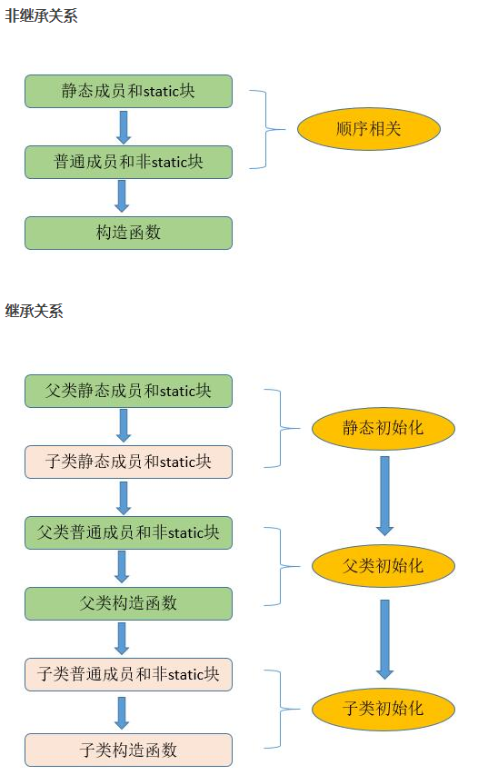

# JAVA初始化

## 方法重载
每个重载的方法必须博包含一个独一无二的参数列表，不能通过返回值加以区分。
## this关键字
在方法内部表示当前对象的引用，方法内部调用同一个类的方法，不必使用this，
直接调用即可。
在构造器中调用另一个构造器，可以使用this关键字。需要注意的是，可以使用一个
this调用一个构造器，但是不能调用两个，而且必须将构造器置于最起始处，否则编译器会报错。
## static关键字
static方法就是没有this 的方法，在static方法内部不能调用非静态方法，反过来是可以
的。
## 成员初始化
java尽力保证：所有变量在使用前都能得到恰当的初始化，对于方法的局部变量，Java以编译时错误的形式来贯彻这种保证。如：
```java
void func(){
    int i;
    i++; // 错误: 可能尚未初始化变量i
}
```
对于类的数据成员，若是基本类型，则编译器会提供一个默认的初始化值。
初始化顺序：


