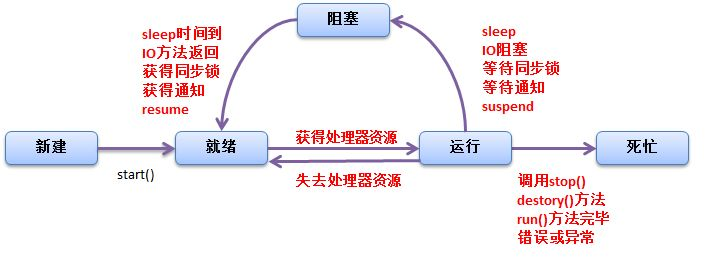

# JAVA多线程

## 线程
进程是程序运行的实例，是程序向操作系统申请资源的基本单位，线程是进程中可独立执行的最小单位。一个进程可以包含多个线程。同一个进程中的所有线程共享该进程中的资源，如内存空间、句柄等。线程所要完成的计算称为任务，特定的线程执行着特定的任务。

### Thread

在java平台中，创建一个线程就是创建一个Thread类（或者子类）的实例。线程的任务处理逻辑可以在Thread的run实例方法中直接实现。它由java虚拟机在运行相应线程时直接调用，而不是由应用代码进行调用。使用Thread的start() 方法启动一个线程，这个方法实质是请求虚拟机运行相应的线程，而这个线程具体何时运行由线程调度器实现。线程中的run方法执行结束，线程的运行也就结束了，运行结束后，该线程所占用的资源会被java虚拟机回收。

Thread类中的常用方法：

| 方法 | 功能 | 说明 |
|---------------|-----------------|------------------|
| static Thread currentThread() | 返回当前线程 | 同一段代码，其返回值可能对应不同的对象（线程） |
| void run() | 线程的任务处理逻辑 | 这个方法是由虚拟机直接调用，一般应用程序不应调用此方法 |
| void start() | 启动线程 | 该方法返回不一定代表相应的线程已经被启动。一个Thread实例的start()方法只能被调用一次，否则会抛出异常 |
| void join() | 等待相应线程运行结束 | 若A线程调用B线程的jion方法，那么A线程就会等待，直到B线程运行结束 |
| static void yeild() | 使当前线程主动放弃对处理器的占用，可能会导致当前线程暂停 | 是否继续执行，是由线程调度器决定 |
| static void sleep(long millis) | 使当前线程休眠指定时间 | |

### 线程的生命周期



### 优势与风险

| 优势 | 风险 |
|:-----------------------|---------------------------|
| 提高系统吞吐率 | 线程安全问题，多个线程访问共享数据，可能会出现数据一致性问题 |
| 提高响应性 | 线程活性问题，线程的生命周期中存在多个状态，可能会出现线程死锁、线程饥饿的问题 |
| 充分利用多核 | 上下文切换，增加了系统开销 |
| 最小化对系统资源的使用 | 可靠性，多线程编程一方面有利于可靠性，例如某个线程意外中止，并不影响其他线程， 另一方面，如果线程由于内存泄漏导致虚拟机崩溃而中止，那么进程中所有线程都无法继续运行 |
| 简化程序的结构 |  |

### 竞态
多个线程对共享数据执行读取或者修改操作，执行结果随着执行次序而不同，这种现象称为竞态。

线程安全表现为3个方面，原子性、可见性和有序性
### 原子性
对于设计共享变量访问的操作，若从其执行线程以外的线程来看是不可分割的，那么该操作就是原子操作，相应的称该操作具有原子操作。

```
需要注意的是：
1. 原子操作是针对访问共享变量的操作而言的。
2. 原子操作是从该操作的执行线程以外的线程来描述的，它只有在多线程环境下才有意义。从其他线程来看，该原子操作要么还未发生，要么已经结束，不可能看到中间结果。
```
java中实现原子性有两种方式：一种是使用锁。另一种是利用处理器专门提供的CAS指令。CAS指令实现原子性的方式与锁实现原子性的方式实质是一样的，差别在于锁是在软件这一层实现的，而CAS实在硬件上实现的。

在java中，除long和double类型以外的任何类型的变量的写操作都是原子操作，即对基础类型(long,double除外)和引用类型的变量的写操作都是原子性的。

在32位虚拟机上，double与long两种类型占64位，它们的写操作分两步进行，一步写32位。java语言规范中没有保证其写操作是原子性的，关于在64位虚拟机上的情况参见
[long和double原子操作的讨论](https://www.zhihu.com/question/38816432)。

但是[java规范](https://docs.oracle.com/javase/specs/jls/se8/html/jls-17.html#jls-17.7),特别规定，对于volatile关键字修饰的long/double类型变量的写操作具有原子性。Writes and reads of volatile long and double values are always atomic.

### 可见性
一个线程对共享变量的更新的结果对于读取相应共享变量的线程而言是不可见的。
可见性的问题与计算机存储系统有关。程序中的变量可能会被分配到寄存器，而不是主存中欧你进行存储。每个处理器都有其寄存器，而一个处理器无法读取另一处理器上的寄存器内的内容。因此，如果两个线程所共享的变量被分配到寄存中进行存储，那么可见性问题就会产生。另外即使某个变量是分配到主存中进行存储的，也不能保证该变量的可见性。这是因为处理器对主存的访问并不是直接的，而是通过高速缓存系统进行的。一个处理器上运行的线程对变量的会更新只会更新到该处理器的写缓冲器中，还没有到达该处理器的高速缓存中，更不用说主存了。而一个处理器的写缓冲器中内容无法被另外一个处理器读取，因此另外运行在另外一个处理器上的线程无法看到这个线程对变量的更新。虽然一个处理器的高速缓存中的内容不能被另外一个处理器直接读取，但是一个处理器可以通过缓存一致性协议来读取其他处理器上的数据，并将读取的数据更新到该处理器的高速缓存中。这种一个处理器从其自身处理器缓存以外的存储部件中读取数据并将其更新到该处理器的高速缓存的过程称为缓存同步。相应的称这些存储部件是可同步的，这些部件包括处理器的高速缓存、主内存。缓存同步使得一个处理器可以读取到另外一个处理器上对共享变量做出的更新，及保障了可见性。因此，为了保障可见性，我们必须使一个处理器对共享变量的更新最终被写入到该处理器的高速缓存中或者主存中，这个过换称为冲刷处理器缓存。并且一个处理器在读取共享变量的时候，如果其他处理器在此之前已经更新了该变量，那么该处理器必须从其他处理器的高速缓存或者主存中对相应的共享变量进行缓存同步。这个过程称为刷新处理器缓存。因此，保证可见性是通过更新共享变量的处理器只从刷处理缓存的动作，并使读取共享变量的处理器执行刷新处理器缓存的动作来实现的。

可见性的保障仅仅意味着一个线程能读取到共享变量的相对新值，而不能保证该线程能读取到相应变量的最新值。

java规范中保证，父线程在启动子线程之前对共享变量的修改对子线程来说是可见的。同样，一个线程终止后该线程对共享变量的修改对于调用该线程jion方法的线程也是可见的。

### 有序性

#### 重排序
顺序结构是结构化编程中的一种基本结构，它表示我们希望某个操作必须先于另外一个操作。但是在多核处理器环境下，这种操作是没有保障的：编译器可能改变两个操作的先后顺序；处理器可能不是完全依照程序的目标代码所指定的顺序执行指令；另外，一个处理器上执行多个操作，从其他处理器角度来看其顺序可能与目标代码所指定的顺序不一致。这种现象称为重排序。

重排序分为指令重排序和存储子系统重排序：

| 重排序类型 | 重排序表现 | 重排序来源 |
|-----------|-----------|-----------|
| 指令重排序 | 程序顺序与源代码顺序不一致 | 编译器 |
| 指令重排序 | 执行顺序与程序顺序不一致 | JIT编译器、处理器 |
| 存储子系统重排序 | 源代码、程序和执行顺序这三者一致，但是感知顺序与执行顺序不一致 | 高速缓存、写缓冲器 |

软件和硬件都可能会导致重排序，但并非随意的进行重排序，而是遵循一定的规则，从而给单线程程序制造一种假象——指令是按照源代码顺序执行的。这种假象称为貌似串行语义。貌似串行语义只是从单线程的角度保证重排序后的运行结果不影响程序的正确性。

### 上下文切换
“线程”上下文切换的开销：
1. 操作系统保存和恢复上下文所需要的开销
1. 线程调度器进行线程调度的开销
1. 处理器高速缓存重新加载的开销
1. 上下文切换可能导致真个一级高速缓存中的内容被冲刷

## 线程同步

### 锁
线程安全问题产生的前提是多个线程并发的访问共享变量、共享资源。于是很容易就可以想到一种保障线程安全的方法——将多个线程对共享数据的访问转换为串行访问。锁就是利用这种思路来保障线程安全。

锁的持有线程在其获得锁之后和释放锁之前这段时间内执行的代码称为临界区。因此，共享数据只允许在临界区内访问，临界区一次只能被一个线程执行。

锁具有排他性，即一个锁只能被一个线程持有。这种锁也称为排他锁和互斥锁（mutex）。java中的锁包括内部锁和显示锁。内部锁是通过sychronized关键字实现的，显示锁是通过Lock接口的实现类来实现的。

锁能保护共享数据以实现线程安全，起作用包含：保障原子性、保障可见性、保障有序性。

锁通过互斥保障原子性。锁一次只能被一个线程持有，因此一个线程持有一个锁的时候，其他线程无法获得该锁。这就保证了临界区代码一次只能被一个线程执行。因此，一个线程执行临界区期间没有其他线程能访问相应的共享数据，这使得临界区代码执行的操作具有不可分割的特性，即保证了原子性。

可见性的保障是通过线程写线程处理器缓存和读线程刷新处理器缓存这两动作实现的。在java平台中，锁的获得隐含着刷新处理器缓存这个动作，这使得该线程在执行临界区代码前可以将写线程对共享变量所做的更新同步到该线程执行处理器的高速缓存中；而锁的释放隐含着冲刷处理器缓存这个动作，这使得写线程对共享变量所做的更新操作能被推送发到该线程执行处理器的高速缓存中，从而对读线程可同步。因此，所能保障可见性。

锁的互斥性和可见性的保障结合在一起，可以保障临界区内的代码能够读取到共享数据的最新值。由于锁的互斥性，同一个锁所保护的共享数据一次只能被一个线程访问，因此线程在临界区中所读取到的共享数据的相对新值，同时也是最新之。锁不仅能保证临界区中的代码能读取到共享变量的最新值。对于引用型变量，锁还可以保证临界区中的代码能读取到该变量所引用对象的字段的最新值。这点也可以推广到数组变量，即如果共享变量是数组，那么锁能保证临界区中的代码可以读取到该数组中各个元素的最新值。

锁能保障有序性。写线程在临界区中所执行的一系列操作在读线程所执行的临界区看起来像是完全按照源代码顺序执行的。这是锁对原子性和可见性保障的结果。

在使用时需要注意：
1. 这些线程在访问同一组共享数据的时候必须使用同一个锁
1. 这些线程中的任意一个线程，即使仅仅是读取这组共享数据而没有进行更新的话，也需要在读取时持有相应的锁。

#### 可重入性
一个线程在持有一个锁的时候还能否再次申请该锁。如果一个线程持有一个锁的情况下还能申请该锁，那么就称该锁是可重入的(Reentrant)，否则我们就称该锁为非可重入的。
#### 锁的争用与调度
锁可以被看作是多线程程序访问共享数据时需要的一种排他性的资源。因此，资源的争用、调度的概念对锁也是适用的。Java中锁的调度策略包括公平策略和非公平策略。内部所属于非公平锁，显示锁既支持又支持非公平锁。
#### 锁的粒度
一个锁实例可以保护一个或者多个共享数据。一个锁实例保护的共享数据的数量大小就称为锁的粒度。

### 内部锁：synchronized关键字

synchronized关键字可以修饰方法以及代码块。其修饰的方法称为同步方法。同步方法的方法体就是一个临界区。
```java
public class TickCounter {
    static class Counter implements Runnable {
        private int count=0;

        public void run() { tick(); }
        private void tick() {
            if (count > 100){ count = 0; }
            else { count = count + 1; }
            System.out.println("count: " + count);
        }
    }

    public static void main(String[] args){
        int count = 5;
        Thread[] threads = new Thread[count];
        Counter counter = new Counter();
        for (int i = 0; i < count; i++) {
            threads[i] = new Thread(counter);
        }
        for (int i = 0; i < count; i++) {
            threads[i].start();
        }
    }
}
```
其输出如下：
```
count: 3
count: 5
count: 3
count: 4
count: 4
```
可以看到出现了两个3，两个4，并且每次运行结果都不一样。
在tick()方法前添加sychronized 修饰，则可保证线程安全
```java
private synchronized void tick()
/**output 多次运行结果均一致
count: 1
count: 2
count: 3
count: 4
count: 5
*/
```
可见锁可以保证线程安全（原子性、可见性、有序性）。另一种使用方式：
```java
synchronized (锁句柄){
    //在此代码块中访问共享数据
}
```
上面的tick()方法也可以修改为:
```java
private void tick() {
    synchronized (this) {
        if (count > 100) {
            count = 0;
        } else {
            count = count + 1;
        }
        System.out.println("count: " + count);
    }
}
```
在这例子中，this也可以更换为count(需要注意的是，这里不接受原始类型，需要将int声明为Integer,此外，会有提示信息：此字段没有声明为final字段)

内部锁的调度。java虚拟机为每一个内部锁分配一个入口集，用于记录等待获得相应内部锁的线程。多个线程申请同一个锁的时候，只有一个申请者能成为该锁的持有者，而其他申请者的申请会失败。这些申请失败的线程不会抛出异常，而是会被暂停并被存入相应的入口集中等待再次申请锁的机会。当这些线程申请的锁被其持有者释放的时候，该锁入口集中的任意一个线程将会被唤醒，从而再次得到申请锁的机会。

### 显示锁：Lock接口
 显示锁是java.util.concurrent.locks.Lock接口的实例。该接口对显示锁进行了抽象。其定义如下：
 ```java
    void lock();//获取锁
    void lockInterruptibly() throws InterruptedException;//如果当前线程未被中断，则获取锁
    boolean tryLock();//仅在调用时锁为空闲状态才获取该锁
    boolean tryLock(long time, TimeUnit unit) throws InterruptedException;//如果锁在给定时间内空闲，并且当前线程未被中断，则获取锁
    void unlock();//释放锁
    Condition newCondition();//返回绑定到此Lock实例的新的Condition实例
}
 ```
 使用方法：

 ```java
private final Lock lock = ...;//创建Lock接口实例
...

lock.lock();//申请锁
try{
    //在此对共享数据的访问
    ....
}finally{
    //总是在finally块中释放锁，以避免锁泄漏
    lock.unlock();//释放锁
}
 ```
上面计数的例子，tick()方法也可改为：
```java
private final Lock lock = new ReentrantLock();
private void tick(){
    lock.lock();
    try{
        if(count > 100){count = 0;}
        else {count = count + 1;}
        System.out.println("count:" + count);
    }finally{
        lock.unlock();
    }
}
```

显示锁支持公平锁，也支持非公平锁。公平锁增加了上下文切换的开销，默认情况下使用的是非公平调度策略。


#### 读写锁
读写锁是一种改进性的排他锁。读写锁允许多个线程同时读取共享变量，但是一次只允许一个线程对共享变量进行更新。

读写锁的两种角色：
| | 获得条件 | 排他性 | 作用 |
| 读锁 | 相应的写锁未被任何线程持有 | 对读线程是共享的，对写线程是排他的 | 允许多个读线程同时读取共享变量，并保证读线程读取期间没有其他线程更新共享变量 |
| 写锁 | 该写锁未被其他任何线程持有，并且相应的读锁也未被其他的线程持有 | 对写线程和读线程都是排他的 | 使得写线程以独占的方式访问共享变量 |

使用方法：
```java
public class ReadWriteLockUsage {
    private final ReadWriteLock readWriteLock = new ReentrantReadWriteLock();
    private final Lock readLock = readWriteLock.readLock();
    private final Lock writeLock = readWriteLock.writeLock();

    public void read(){
        readLock.lock();
        try {
            //在此处读取共享变量
        }finally {
            readLock.unlock();
        }
    }

    public void write(){
        writeLock.lock();
        try {
            //在此处读写共享变量
        }finally {
            writeLock.unlock();
        }
    }
}
```
使用方法与显示锁类似，也需要注意锁泄漏问题，需要将释放锁操作放在finally块中。

### 线程同步机制
锁保证可见性是通过两个动作来实现的：刷新处理器缓存和冲刷处理器缓存。对于同一个锁保护的共享数据而言，前一个动作保证了该锁的当前持有线程能够读取到前一个持有线程对这些数据的更新，后一个动作保证了该锁的持有线程对这些数据所做的更新对该锁的后续持有线程可见。

java虚拟机中采用Memory Barrier的技术来实现这两个动作，其作用是禁止编译器、处理器重排序从而保障有序性。它在指令序列中就像是一堵墙，两侧的指令无法穿越。根据Memory Barrier所起的作用可以分为几种：
1. 按照可见性保障来划分，Memory Barrier可以分为加载屏障和存储屏障。加载屏障的作用是刷新处理器缓存，存储屏障的作用是冲刷处理器缓存。java虚拟机uhi在释放锁对应的机器码指令之后插入一条存储屏障，相应的在申请锁对应的指令之后的临界区之前插入一个加载屏障。这样就保证了数据的可见性。
1. 按照有序性保障来分，Memory Barrier可以分为获取屏障和释放屏障。获取屏障的而使用方式是在一个读操作之后插入该屏障，其作用是其作用是禁止该读操作与其后面的任何读写操作之间进行重排序。释放屏障的使用方法是在一个写操作之前插入该内存屏障，其作用是禁止该写操作与其前面的任何读写操作之间进行重排序。Java虚拟机会在申请锁对应的指令之后临界区区开始之前的地方插入一个获取屏障，并在临界区结束之后的地方插入一个释放屏障。

### 锁与重排序
锁机制需要重排序遵循一定的规则才能实现：
* 规则1——临界区的操作不允许被重排序到临界区外
* 规则2——临界区内的操作之间可以被重排序
* 规则3——临界区外的操作之间可以被重排序

这3个规则比较容易理解，规则1是原子性和可见性的保证。规则2和规则3是为了在保证功能的前提下降低对性能的损耗。
* 规则4——锁申请和释放不能被重排序
* 规则5——两个锁申请不能被重排序
* 规则6——两个锁释放不能被重排序

* 规则7——临界区外的操作可以重排序到临界区内

### volatile关键字
volatile关键字表示被修饰的变量值容易变化（被其他线程更新），因而不稳定。这中不稳定性意味着对这种变量的操作都必须从高速缓存或者主存中读取，以读取变量的相对新值。

#### volatile的作用
volatile关键字的作用：保障可见性、保障有序性和保障long/double类型变量读写操作的原子性。

写线程会对volatile变量的写操作产生类似于释放锁的效果。该线程对volatile读操作会产生类似于获得锁的效果。所以，volatile具有保障可见性和有序性的作用。
对于volatile变量的写操作，java虚拟机会在该操作之前插入一个释放屏障，在操作之后插入一个存储屏障。释放屏障禁止了volatile写操作与该操作之前的任何读写操作进行重排序，从而保证了volatile写操作之前的任何读写操作进行重排序，从而保证了volatile写操作之前的任何读、写操作会先于volatile写操作被提交，即其他线程看到写线程对volatile变量的更新，写线程在更新volatile变量之前执行的内存操作的结果对于读线程必然也是可见的。

```
volatile关键字在可见性方面的保障仅仅是保障读线程能读取到共享变量的相对新值。对于引用变量和数组变量，volatile关键字并不能保障读线程能读取到相应对象的字段、元素的相对新值。
```

volatile变量的读写操作不会引起上下文的切换，因此volatile的开销比锁要小。写一个volatile变量会使该操作以及该操作之前的任何写操作的结果对于其他处理器是可同步的，因此，volatile变量的成本介于普通变量的写操作和临界区内进行的写操作之间。读取volatile变量的成本也比临界区内读取变量要低，但是可能比普通变量要高一些。

volatile关键字除了保障long/double型变量的读写的原子性，典型的适用场景如下：
* 使用volatile变量作为状态标志。应用程序的状态由一个线程设置，其他线程会读取该状态并以该状态作为计算依据。
* 使用volatile保障可见性。多个线程共享一个可变状态变量，其中一个线程更新了该变量之后，其他线程在无需加锁的情况下也能看到该更新。
* 使用volatile代替锁。多个线程共享一组可变状态变量的时候，通常我们需要使用锁机制来保障更新操作的原子性，以避免数据不一致的问题。利用volatile变量的写操作具有原子性，我们可以将这一组变量封装成一个对象，那么对这些状态变量的更新操作就可以通过创建一个新的对象并将该对象的引用赋值给相应的引用型变量来实现。在这个过程中，volatile保证了原子性和可见性，从而避免了锁的使用。（组合中的每一个状态变量也需要是volatile变量）
* 开销较低的读－写锁策略.
```java
@ThreadSafe
public class CheesyCounter {
    // Employs the cheap read-write lock trick
    // All mutative operations MUST be done with the 'this' lock held
    @GuardedBy("this") private volatile int value;
 
    public int getValue() { return value; }
 
    public synchronized int increment() {
        return value++;
    }
}
// 如果用synchronized修饰了setter方法，只能保证setter方法是原子的，
// 也就是写的时候可以把最新值写回主内存，但是调用getter方法但是没有用
// volatile修饰value的话，线程并不会从主内存中读取value的值，只会从线程
// 本地内存中读取线程自己所缓存的这个对象的值。
```
#### CAS和原子变量

#### 对象的初始化安全：final与static
java中的类的初始化实际上采用了延迟加载的技术，即一个类被java虚拟机加载之后，该类的所有静态变量的值仍然是默认值，直到有个线程初次访问该类的任意一个静态变量才使这个类被初始化。

static关键字在多线程环境下有其特殊的含义，它能保证一个线程即使在未使用其他同步机制的情况下也总是可以读取到一个类的静态变量的初始值。但是这种可见性的保证仅限于线程初次读取该变量。如果这个静态变量在相应类初始化完毕后被其他线程更新过，那么一个线程要读取该变量对相对新值仍然需要借助锁，volatile关键字等同步机制。

当一个对下个被发布到其他线程的时候，该对象的所有final字段都是初始化完毕的，即其他线程读取到这些字段的时候所读取到的值都是相应字段的初始值。非final字段则没有这种保障，即这些线程可能读取到的值是相应字段的默认值。
