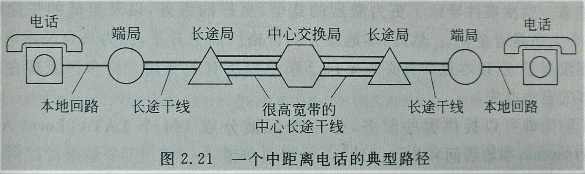

# 计算机网络-物理层

通过某种物理特性的变化，在线路上进行传输信息。

物理层的设计目的是将原始的位流从一台机器传输到另一台机器上。有多种物理介质可以用于实际的传输过程，这些介质大致可以分为两大部分：有导向的传输介质和无导向的传输介质。
## 有导向的传输介质
1. 磁介质：带宽大，成本低，延迟性非常差
1. 双绞线：两根铜线以螺旋状的形式绞在一起。常用于电话系统，双绞线可以用来传输模拟信号和数字信号
1. 同轴电缆：比双绞线更高的带宽以及很好的抗噪特性，可以达到1GHz的带宽，广泛用于有线电视和城域网中。
1. 光纤：传输带宽非常大，通常是计算能力的限制

## 无导向的传输介质
1. 电磁波
1. 无线电
1. 微波
1. 红外线和毫米波
1. 光波传输

## 通信卫星

地面的光纤连接相对于通讯卫星，带宽高得多，但是通信卫星有光纤不能涉及的领域：
* 移动通信
* 传输模式为广播的场合
* 位于恶劣地形或者地面设施很差的地区的通信
* 快速部署

## 公共交换电话网络

电话系统由三个主要的部件构成：
* 本地回路，双绞线进入家庭和业务部门，模拟信号
* 干线，通过光纤将交换局连接起来，数字信号
* 交换局，电话呼叫从一条线接入到另一条干线

### 本地回路：调制解调器、ADSL和无线
调制解调器：设备接受一个位序列作为输入，并且产生一个经过一种或者多种方法调制的载波输出，这样的设备就称为调制解调器。

