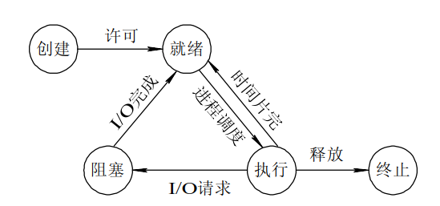

# 操作系统-进程管理
## 进程状态
1. 运行态：CPU正在执行的进程状态
2. 就绪态：没有外部等待事件的进程被认为是处于等待状态的进程。操作系统维护了一个包含所有的等待状态的进程的链表，在CPU空闲时，按照一定的调度策略选择其中的一个进行执行。
3. 阻塞态：当进程在等待如I/O操作之类的外部事件时，就认为处于阻塞状态。

状态转移：

操作系统使用名为进程控制块（PCB）的数据结构维护每个进程的信息，每一个用户进程都有一个PCB。PCB中包含：
1. 进程标识号PID
2. 进程状态
3. 进程优先级
4. 寄存器内存保护区：在进程切换时，需要保存所有的CPU寄存器信息。
5. 指向进程内存的指针
6. 打开文件列表
7. 统计信息：CPU时间、IO等资源使用信息。
8. 其他信息以及资源指针
9. 指向其他PCB的指针

